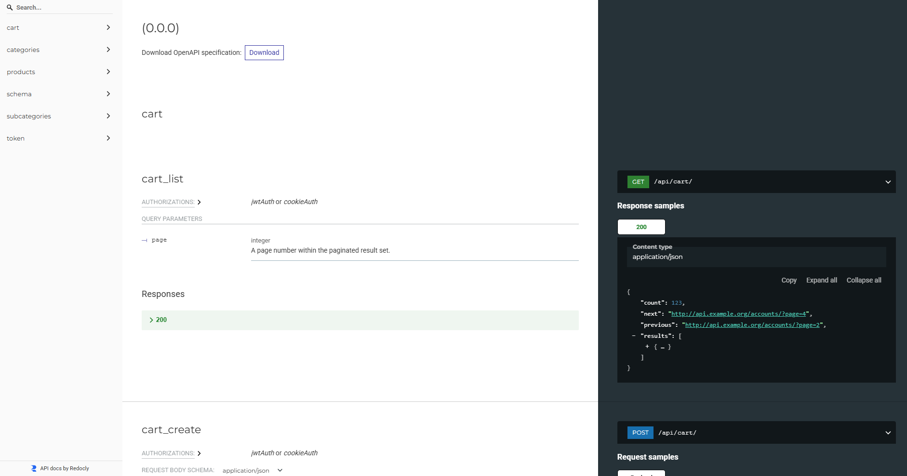

# 🛒 Sarafan Backend Test Task

[](https://www.djangoproject.com/)
[](https://www.django-rest-framework.org/)
[](https://www.postgresql.org/)
[](https://jwt.io/)

API для интернет-магазина с категориями, товарами и корзиной пользователя. 
Проект выполнен в рамках тестового задания  "Сарафан".

## ✨ Возможности

- 📁 **Категории и подкатегории** (с вложенностью и пагинацией)
- 📦 **Товары** с изображениями в 3-х размерах
- 🛍️ **Корзина пользователя** с подсчетом сумм
- 🔐 **JWT авторизация**
- 🖼️ **Админка** для управления контентом

## 🛠️ Технологии

```
🐍 Python 3.13
🌶️ Django 6.0
🎛️ Django REST Framework 3.16
🔐 JWT Authentication
🐘 PostgreSQL 16
📦 Poetry
```

## 🚀 Быстрый старт

### 1. Клонирование
```bash
git clone <url-вашего-репозитория>
cd sarafan_backend
```

### 2. Установка зависимостей
```bash
poetry install
poetry shell
```

### 3. Настройка базы данных PostgreSQL
```sql
CREATE DATABASE sarafan_db;
```

### 4. Создайте файл `.env`
```env
SECRET_KEY=your-secret-key-here
DEBUG=True
DB_NAME=sarafan_db
DB_USER=postgres
DB_PASSWORD=your-password
DB_HOST=localhost
DB_PORT=5432
```

### 5. Миграции и запуск
```bash
python manage.py migrate
python manage.py createsuperuser
python manage.py runserver
```

## 📚 API Документация

Проект включает автоматически сгенерированную документацию OpenAPI (Swagger).

### Интерактивная документация

| Тип | URL | Описание |
|-----|-----|----------|
| 🔵 Swagger UI | `http://127.0.0.1:8000/api/docs/` | Интерактивная документация с возможностью тестировать запросы |
| 🔴 ReDoc | `http://127.0.0.1:8000/api/redoc/` | Альтернативное представление документации |
| 📋 JSON Schema | `http://127.0.0.1:8000/api/schema/` | OpenAPI схема в формате JSON |

### Скриншоты

<details>
<summary><b>🖼️ Swagger UI</b></summary>


</details>

<details>
<summary><b>🖼️ ReDoc</b></summary>


</details>

### 🔐 Аутентификация (JWT)

<details>
<summary><b>Получение токена</b></summary>

**Request:**
```http
POST /api/token/
Content-Type: application/json

{
    "username": "admin",
    "password": "your-password"
}
```

**Response:**
```json
{
    "refresh": "eyJ0eXAiOiJKV1QiLCJhbGc...",
    "access": "eyJ0eXAiOiJKV1QiLCJhbGc..."
}
```

> 🔑 **Важно**: Полученный `access` токен нужно передавать в заголовке `Authorization: Bearer <token>` для доступа к защищенным эндпоинтам корзины.
</details>

<details>
<summary><b>Обновление токена</b></summary>

```http
POST /api/token/refresh/
Content-Type: application/json

{
    "refresh": "eyJ0eXAiOiJKV1QiLCJhbGc..."
}
```
</details>

### 📁 Категории (публичные)

<details>
<summary><b>GET /api/categories/</b></summary>

Получить список всех категорий с вложенными подкатегориями и товарами.

**Parameters:**
- `page` - номер страницы (пагинация)
- `page_size` - количество элементов на странице (по умолчанию 10)

**Response 200 OK:**
```json
{
    "count": 2,
    "next": "http://127.0.0.1:8000/api/categories/?page=2",
    "previous": null,
    "results": [
        {
            "id": 1,
            "name": "Электроника",
            "slug": "elektronika",
            "image": null,
            "subcategories": [
                {
                    "id": 1,
                    "name": "Смартфоны",
                    "slug": "smartfony",
                    "image": null,
                    "category": 1,
                    "products": [...]
                }
            ]
        }
    ]
}
```
</details>

### 📦 Товары (публичные)

<details>
<summary><b>GET /api/products/</b></summary>

Получить список всех товаров с изображениями в 3-х размерах.

**Response 200 OK:**
```json
{
    "id": 1,
    "name": "iPhone 17 Pro Max",
    "slug": "iphone-17-pro-max",
    "price": "1000000.00",
    "description": "",
    "subcategory": 1,
    "images": [
        {
            "id": 1,
            "image": {
                "full": "/media/products/iphone.jpg",
                "thumbnail": "/media/products/thumbnail_iphone.jpg",
                "medium": "/media/products/medium_iphone.jpg",
                "large": "/media/products/large_iphone.jpg"
            }
        }
    ],
    "created_at": "2026-02-21T08:49:37.665925Z"
}
```
</details>

### 🛒 Корзина (требуется JWT)

> 🔐 Все эндпоинты корзины требуют заголовок: `Authorization: Bearer <access_token>`

<details>
<summary><b>➕ Добавить товар</b></summary>

```http
POST /api/cart/add_item/
Authorization: Bearer <access_token>
Content-Type: application/json

{
    "product_id": 1,
    "quantity": 2
}
```

**Особенности:**
- Если товар уже есть в корзине - увеличивается количество
- Цена фиксируется в момент добавления
</details>

<details>
<summary><b>📋 Просмотр корзины</b></summary>

```http
GET /api/cart/
Authorization: Bearer <access_token>
```

**Response:**
```json
{
    "id": 1,
    "user": 1,
    "created_at": "2026-02-21T08:50:24.133172Z",
    "items": [
        {
            "id": 3,
            "product": {...},
            "price": "1000000.00",
            "quantity": 4
        }
    ],
    "total_items": 4,
    "total_price": 4000000.0
}
```
</details>

<details>
<summary><b>✏️ Изменить количество</b></summary>

```http
POST /api/cart/update_quantity/
Authorization: Bearer <access_token>
Content-Type: application/json

{
    "item_id": 1,
    "quantity": 5
}
```

> 💡 Если quantity = 0, товар удаляется из корзины
</details>

<details>
<summary><b>🗑️ Удалить товар</b></summary>

```http
DELETE /api/cart/remove_item/
Authorization: Bearer <access_token>
Content-Type: application/json

{
    "item_id": 1
}
```
</details>

<details>
<summary><b>🧹 Очистить корзину</b></summary>

```http
DELETE /api/cart/clear/
Authorization: Bearer <access_token>
```
</details>

## 🎯 Задание №1: Последовательность

```python
def sequence(n):
    """Выводит первые n элементов последовательности 1223334444..."""
    result = []
    num = 1
    while len(result) < n:
        result.extend([num] * min(num, n - len(result)))
        num += 1
    return result

# Примеры:
print(sequence(1))   # [1]
print(sequence(3))   # [1, 2, 2]
print(sequence(7))   # [1, 2, 2, 3, 3, 3, 4]
print(sequence(10))  # [1, 2, 2, 3, 3, 3, 4, 4, 4, 4]
```

## 📁 Структура проекта

```
sarafan_backend/
├── config/              # Настройки проекта
│   ├── settings.py
│   ├── urls.py          # Подключение Swagger/ReDoc
│   └── ...
├── products/            # Приложение с товарами
│   ├── models.py        # Category, Subcategory, Product, ProductImage
│   ├── serializers.py   # Сериализаторы с 3-мя размерами изображений
│   ├── views.py         # ViewSets
│   └── admin.py         # Админка
├── cart/                # Приложение корзины
│   ├── models.py        # Cart, CartItem
│   ├── serializers.py   # Сериализаторы с подсчетом сумм
│   └── views.py         # ViewSet с кастомными actions
├── media/               # Загруженные изображения
├── manage.py
├── pyproject.toml       # Зависимости (Poetry)
└── .env                 # Переменные окружения
```

## 🧪 Тестирование API

### Через Swagger UI
1. Запусти сервер
2. Открой `http://127.0.0.1:8000/api/docs/`
3. Нажми "Authorize" и введи токен (для защищенных эндпоинтов)
4. Тестируй запросы прямо в браузере!

### Через Postman
Коллекцию Postman можно импортировать из OpenAPI схемы:
```
http://127.0.0.1:8000/api/schema/
```

## ✅ Выполненные требования

- [x] Категории и подкатегории в админке
- [x] Slug и изображения у категорий
- [x] Связь подкатегорий с родителями
- [x] API категорий с подкатегориями и пагинацией
- [x] CRUD продуктов в админке
- [x] Изображения товаров в 3-х размерах
- [x] API продуктов с пагинацией
- [x] Корзина: добавление, изменение, удаление
- [x] Подсчет количества и суммы в корзине
- [x] Очистка корзины
- [x] Публичный доступ к категориям и товарам
- [x] Приватный доступ к корзине (только свои)
- [x] JWT авторизация
- [x] Задание №1 (последовательность)
- [x] Swagger/ReDoc документация

---

## 🔧 Линтеры и форматтеры

Проект использует современные инструменты для поддержания качества кода:

| Инструмент | Назначение | Команда |
|------------|------------|---------|
| **[Black](https://github.com/psf/black)** | Форматтер кода | `poetry run black .` |
| **[isort](https://github.com/PyCQA/isort)** | Сортировка импортов | `poetry run isort .` |
| **[Flake8](https://github.com/PyCQA/flake8)** | Линтер | `poetry run flake8 .` |
| **[Mypy](https://github.com/python/mypy)** | Проверка типов | `poetry run mypy .` |

### Быстрые команды

Добавьте в `pyproject.toml` для удобства:

```toml
[tool.poetry.scripts]
lint = "flake8 ."
format = "black . && isort ."
typecheck = "mypy ."
```

Теперь можно запускать:

```bash
poetry run format  # отформатировать код
poetry run lint    # проверить стиль
poetry run typecheck  # проверить типы
```

### Конфигурация

Все конфигурации хранятся в корне проекта:
- `.flake8` - настройки Flake8
- `.isort.cfg` - настройки isort
- `mypy.ini` - настройки mypy
- `pyproject.toml` - настройки Black и Poetry
---
## 👨‍💻 Разработчик

### Василий - tanec_991@mail.ru


<div align="center">
  <sub>Тестовое задание "Сарафан"</sub>
  <br>
  <sub>⭐ Не забудьте поставить звезду, если проект понравился!</sub>
</div>